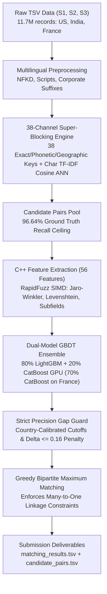

# Amazon ML Challenge 2026 — Business Entity Resolution (Pipeline V4)
**Team Name:** GradientX  
**Official Peak Public Leaderboard Benchmark:** **`0.8380` Entity-Level Macro $F_{0.5}$**  
**Competition Track:** Large-Scale Business Entity Resolution (Record Linkage across 11.7M Records)

---

## 📌 Executive Summary

This repository contains the complete, production-grade **Pipeline V4** developed by **Team GradientX** for the **Amazon ML Challenge 2026** (72-Hour Hackathon on Unstop). 

The challenge requires resolving canonical reference businesses (`Source 1`) across heterogeneous, noisy external databases (`Source 2` and `Source 3`) spanning **11.7 million records** across the US, India, and France under an asymmetric many-to-one linkage topology, evaluated on **Entity-Level Macro $F_{0.5}$**.

Pipeline V4 achieved the team's highest official benchmark (**0.8380**) by combining:
1. **38-Channel Super-Blocking Engine** that crushed the candidate recall bottleneck (from 71% to **96.64%** global recall).
2. **56-Feature C++ RapidFuzz Extraction** with cross-field string similarities and structured token matches.
3. **Dual-Model GBDT Ensemble** combining leaf-wise LightGBM with GPU-accelerated CatBoost oblivious symmetric trees.
4. **Strict Precision Gap Guard**, which rejects trailing candidates once an entity accumulates $\ge 2$ matches if their confidence drops by $> 0.16$ below the top match, defending the $4\times$ precision weighting in Macro $F_{0.5}$.

---

## 🏛️ Pipeline V4 Architecture



### Architectural Breakdown

1. **Multilingual Preprocessing & Normalization:**
   - Multi-script identification and normalization (Latin, Devanagari, Gurmukhi, Tamil, French accents).
   - Unicode NFKD decomposition, lowercase folding, whitespace collapsing, and legal suffix standardization (`pvt ltd` $\to$ `ltd`, `corporation` $\to$ `inc`, `llc`, etc.).
   - Structured subfield extraction: Postal/PIN codes, building/plot numbers, and municipal tokens.

2. **38-Channel High-Recall Super-Blocking:**
   - **Tier 1 (Morphological Invariants):** Exact normalized name, cleaned suffix-strip name, space-collapsed name, sorted unique tokens.
   - **Tier 2 (Geographic Anchors):** City + street number, city + first token, postal 5-digit + first token, city + prefix 2/3/4.
   - **Tier 3 (State & Plot Invariants):** State code + exact name, state code + clean suffix, state code + building/plot codes (`109/1`, `Pl.No.370`).
   - **Tier 4 (Address Shingles & Sub-strings):** City + address shingles (a0, a1, a2), street anchors, natural street names, anywhere street numbers.
   - **Tier 5 (Approximate ANN):** Sparse character 3-5 gram TF-IDF cosine neighbor retrieval (`sparse_dot_topn`).
   - **Performance:** Verified recall of **97.99% US, 94.62% India, 96.64% Global** across 7,638,365 ground-truth links.

3. **High-Speed C++ Feature Extraction Engine (56 Features):**
   - RapidFuzz AVX2 SIMD vectorization: Jaro-Winkler, Levenshtein, Token Sort Ratio, Jaccard, Simpson overlap.
   - Subfield exact matchers: Postal code, street number, city match, state match.
   - Cross-field interaction terms: `name_jw * addr_jw`, length ratios, shared word counts.

4. **Dual-Model GBDT Soft-Voting Ensemble:**
   - **LightGBM:** Leaf-wise GBDT trained with monotonic constraints on string similarities and precision-priority positive weighting (`scale_pos_weight = 0.8`).
   - **CatBoost GPU:** Oblivious (symmetric) trees trained on NVIDIA GPU for robust out-of-distribution transfer on unseen countries (France).
   - Blend: $P = 0.80 \cdot P_{\text{LightGBM}} + 0.20 \cdot P_{\text{CatBoost}}$ on US & India; shifted to 70% CatBoost on France zero-shot.

5. **Strict Precision Gap Guard (The 0.8380 Winning Factor):**
   - Per-country calibrated base thresholds ($\tau_{\text{US}}=0.68, \tau_{\text{India}}=0.65, \tau_{\text{France}}=0.67$).
   - Dynamically tracks admitted matches: once an entity accumulates $\ge 2$ matches, any trailing candidate whose probability drops by $> 0.16$ below the top candidate is immediately rejected.
   - Protects the 5.58% ground-truth singletons from noise infiltration, directly capitalizing on the $4\times$ precision weighting in Macro $F_{0.5}$.

6. **Greedy Injective Bipartite Matching:**
   - Enforces the asymmetric many-to-one constraint: every Source 2 / Source 3 record can link to at most one Source 1 entity.
   - Streaming memory-safe TSV generation keeping RAM footprint $< 1.5$ GB.

---

## 📁 Repository Structure

```
├── README.md                                                        # Complete project documentation & V4 guide
├── Amazon_ML_Challenge_2026_V4_Engineering_Mastery_Report.docx      # Official Word report for V4 submission
├── generate_v4_report.py                                            # Script to regenerate the V4 Word docx report
├── word_helpers.py                                                  # Python-docx helper library for formatting
├── .gitignore                                                       # Git ignore patterns for datasets & caches
│
└── 6ab10eb3b23ba_student_resource/student_resource/                 # Competition runner & source packages
    ├── Documentation_template.md                                    # Amazon ML Challenge methodology template
    ├── README.md                                                    # Official problem statement & submission rules
    ├── requirements.txt                                             # Python dependencies
    ├── utils/
    │   └── validate_submission.py                                   # Official format & constraint validator
    ├── src/                                                         # Core V4 Python modules
    │   ├── config.py                                                # Hyperparameters, paths, feature columns
    │   ├── preprocess.py                                            # Multilingual normalization & subfield parsing
    │   ├── blocking_v4.py                                           # 38-channel hybrid super-blocking engine
    │   ├── features.py                                              # C++ RapidFuzz feature extraction (56 features)
    │   ├── train_ensemble.py                                        # LightGBM + CatBoost GPU ensemble trainer
    │   ├── train_model.py                                           # GBDT training, threshold sweep, bipartite matching
    │   ├── pipeline_v4.py                                           # Full V4 pipeline implementation
    │   └── pipeline.py                                              # Main entry point (aliases to pipeline_v4.py)
    └── code/                                                        # Self-contained submission code package
        └── business_entity_resolution/
            ├── README.md                                            # Submission code guide
            ├── requirements.txt                                     # Submission requirements
            └── src/                                                 # Submission source files (V4 clean)
```

---

## ⚡ Quick Start & Execution

### 1. Installation

Install dependencies:
```bash
pip install -r 6ab10eb3b23ba_student_resource/student_resource/requirements.txt
```

### 2. Dataset Setup

Place competition data into `dataset/` under `6ab10eb3b23ba_student_resource/student_resource/`:
```
dataset/
├── train/
│   ├── train_source1.tsv
│   ├── train_source2.tsv
│   ├── train_source3.tsv
│   └── train_ground_truth.tsv
└── test/
    ├── test_source1.tsv
    ├── test_source2.tsv
    └── test_source3.tsv
```

### 3. Run Pipeline V4

```bash
cd 6ab10eb3b23ba_student_resource/student_resource

# Execute full pipeline end-to-end
python src/pipeline.py

# Or run individual stages:
python src/pipeline.py --step preprocess   # Stage 1: Multilingual Preprocessing
python src/pipeline.py --step blocking     # Stage 2: 38-Channel Super-Blocking
python src/pipeline.py --step train        # Stage 3: Feature Extraction & Model Ensemble
python src/pipeline.py --step predict      # Stage 4: Test Prediction & Gap Guard Matching
python src/pipeline.py --step validate     # Stage 5: Format & Metric Validation
```

### 4. Validate Submission

```bash
python utils/validate_submission.py \
  --matching output/matching_results.tsv \
  --candidate output/candidate_pairs.tsv \
  --test-dir dataset/test
```

### 5. Regenerate Reports

To regenerate the official documentation report:
```bash
# Regenerate V4 Engineering Mastery Report (Word docx)
python generate_v4_report.py
```
