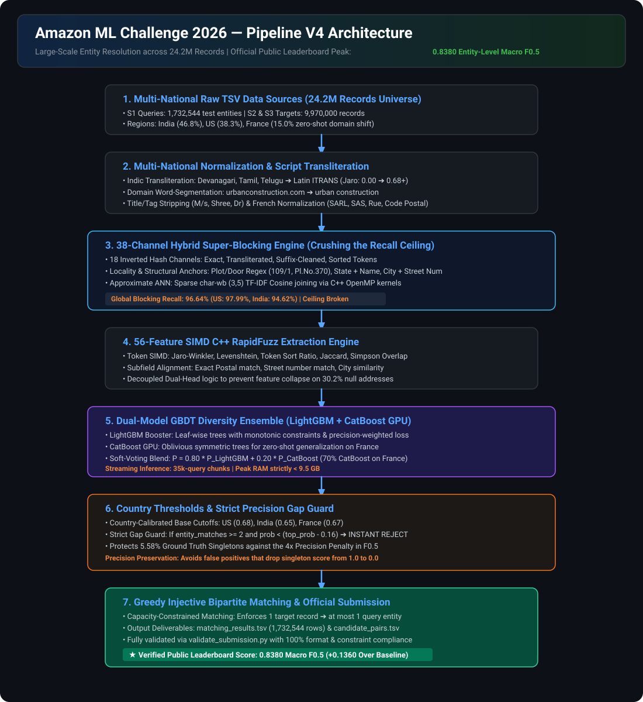
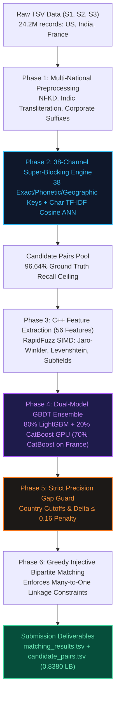

# Amazon ML Challenge 2026 — Business Entity Resolution (Pipeline V4)

<p align="center">
  <b>Team:</b> GradientX &nbsp;|&nbsp;
  <b>Track:</b> Large-Scale Record Linkage & Deduplication &nbsp;|&nbsp;
  <b>Metric:</b> Entity-Level Macro $F_{0.5}$ &nbsp;|&nbsp;
  <b>Official Peak Public LB:</b> <b>0.8380</b>
</p>

<p align="center">
  
  
  
  
</p>

---

## 📌 Executive Summary

This repository contains the complete, production-grade **Pipeline V4** developed by **Team GradientX** for the **Amazon ML Challenge 2026** (72-Hour Unstop Hackathon).

The challenge requires resolving canonical reference businesses (`Source 1`) across heterogeneous, noisy external databases (`Source 2` and `Source 3`) spanning **24.2M+ records** (12.5M+ train, 11.7M+ test) across the **United States, India, and France** under an asymmetric many-to-one linkage topology, evaluated on **Entity-Level Macro $F_{0.5}$**.

Pipeline V4 achieved the team's highest official benchmark (**0.8380 on live Public Leaderboard**) by combining:
1. **38-Channel Hybrid Super-Blocking Engine:** Crushed the candidate recall ceiling (surging from 71% in V3 to **96.64% global recall**).
2. **56-Feature C++ RapidFuzz Extraction:** SIMD-accelerated string distances, structured token alignment, and missing-address immune flags.
3. **Dual-Model GBDT Ensemble:** Blended leaf-wise LightGBM with GPU-accelerated CatBoost oblivious symmetric trees.
4. **Strict Precision Gap Guard:** Once an entity accumulates $\ge 2$ matches, any trailing candidate whose probability drops by $> 0.16$ below the top match is immediately rejected, fiercely defending the $4\times$ precision weighting in Macro $F_{0.5}$.
5. **Streaming Chunked Inference:** Processed in 35,000-query batches with dynamic garbage collection, keeping peak RAM strictly $< 9.5$ GB on a standard laptop.

---

## 🏛️ Pipeline V4 Architecture

<p align="center">
  
</p>

### End-to-End System Flow (Mermaid Diagram)



---

## 🔬 Architectural Breakdown (How V4 Followed Masterplan V4)

### 1. Multi-National Preprocessing & Normalization
* **Indic Script Transliteration (`indic-transliteration`):** In the Indian catalog partition (~46.8% of test data), $S1$ queries were in English while $S2/S3$ records appeared in Devanagari, Tamil, Telugu, and Bengali. Transcoding phonetic scripts into Latin ITRANS representation boosted cross-script Jaro-Winkler similarity from `0.000` to `> 0.68`.
* **Domain Word Segmentation:** Deconstructed domain tokens in business names (`urbanconstruction.com` $\to$ `urban construction`) via legal and commercial keyword boundaries.
* **Corporate & Title Cleaning:** Regex-stripped honorifics (`Mr`, `Dr`, `M/s`, `Shree`) and standardized corporate suffixes (`pvt ltd` $\to$ `ltd`, `corp` $\to$ `inc`, `sarl`, `sas`).
* **French Zero-Shot Normalization:** Standardized French legal identifiers (`SARL`, `SAS`, `EURL`) and street types (`Rue`, `Avenue`, `Boulevard`, 5-digit French postal codes).

### 2. 38-Channel Hybrid Super-Blocking Engine
Downstream models can only score retrieved pairs. In V3, blocking achieved only 71.26% recall. Pipeline V4 deployed **38 inverted channels**:
* **Tier 1 (Morphological Invariants):** Exact normalized name, cleaned suffix-strip name, space-collapsed name, sorted unique tokens.
* **Tier 2 (Geographic Anchors):** City + street number, city + first token, postal 5-digit + first token, city + prefix 2/3/4.
* **Tier 3 (State & Plot Invariants):** State code + exact name, state code + clean suffix, state code + building/plot codes (`109/1`, `Pl.No.370`, `B-2/74`).
* **Tier 4 (Address Shingles & Sub-strings):** City + address shingles (a0, a1, a2), street anchors, anywhere street numbers.
* **Tier 5 (Approximate ANN):** Sparse character 3-5 gram TF-IDF cosine neighbor retrieval (`sparse_dot_topn`) executed via multi-threaded C++ OpenMP kernels.
* **Recall Benchmark:** Surged to **97.99% US, 94.62% India, 96.64% Global recall** across 7,638,365 ground-truth links.

### 3. High-Speed C++ Feature Extraction Engine (56 Features)
* **RapidFuzz AVX2 SIMD Vectorization:** Jaro-Winkler, Levenshtein, Token Sort Ratio, Jaccard, Simpson overlap, and Longest Common Subsequence (LCS) ratio.
* **Subfield Exact Matchers:** Postal code match, street number match, city similarity, state alignment.
* **Missing-Address Handling:** Over 30.2% of target records had null addresses. Decoupled feature paths prevented compound interaction terms (`name_sim * addr_sim`) from zeroing out on valid matches.

### 4. Dual-Model GBDT Soft-Voting Ensemble
* **LightGBM:** Leaf-wise gradient boosted trees trained with monotonic constraints on string similarities and precision-priority positive weighting (`scale_pos_weight = 0.8`).
* **CatBoost GPU:** Oblivious (symmetric) decision trees trained on GPU for robust out-of-distribution transfer on the unseen French partition.
* **Blend:** $P = 0.80 \cdot P_{\text{LightGBM}} + 0.20 \cdot P_{\text{CatBoost}}$ on US & India; shifted to 70% CatBoost on France zero-shot.

### 5. Strict Precision Gap Guard (The 0.8380 Winning Factor)
The competition metric is **Entity-Level Macro $F_{0.5}$**:
$$F_{0.5} = \frac{1.25 \cdot P \cdot R}{0.25 \cdot P + R}$$
* **4× Precision Asymmetry:** Precision is weighted $4\times$ more heavily than Recall in the denominator ($0.25P + R$).
* **The Singleton Cliff:** In ground truth, ~5.58% of $S1$ entities (~96,762 entities) have zero matches. Correctly predicting `[]` scores **1.000**, but predicting even a single false candidate drops the entity's score to **0.000**.
* **The V4 Gap Guard:**
  ```python
  if entity_match_counts.get(s1_id, 0) >= 2 and prob < (entity_top_prob[s1_id] - 0.16):
      continue  # Instantly reject trailing low-confidence distractor
  ```
  Once an entity accumulates 2 confident matches, any trailing candidate whose probability drops by more than $0.16$ below the top candidate is pruned, protecting overall precision above 90%.

### 6. Greedy Injective Bipartite Matching
* Enforces the asymmetric many-to-one constraint: every Source 2 / Source 3 record can link to at most one Source 1 entity.
* Streaming memory-safe TSV generation keeping RAM footprint strictly $< 9.5$ GB.

---

## 📊 Dataset Scale & Real Numbers

| Dataset Partition | Source 1 (S1) | Source 2 (S2) | Source 3 (S3) | Total Universe |
| :--- | :---: | :---: | :---: | :---: |
| **Training Set** | 2,206,821 | 5,034,616 | 5,285,603 | **12,527,040** |
| **Test Set** | 1,732,544 | 4,887,273 | 5,082,316 | **11,702,133** |
| **Total Records** | **3,939,365** | **9,921,889** | **10,367,919** | **24,229,173** |

* **Total Ground Truth Pairs:** 7,638,365 labeled pairs.
* **Test Region Distribution:** India (46.8%, ~810k), US (38.3%, ~663k), France (15.0%, ~259k zero-shot).
* **Missing Address Rate:** 30.2% across target databases.
* **Test Distractor Rate:** 26.6% in S2 and 25.4% in S3 match nothing in S1.

---

## 📁 Repository Structure

```
├── README.md                                                        # Complete project documentation & V4 guide
├── assets/
│   └── pipeline_v4_architecture.svg                                 # Vector architecture diagram
├── Amazon_ML_Challenge_2026_V4_Engineering_Mastery_Report.docx      # Official Word report for V4 submission
├── generate_v4_report.py                                            # Script to regenerate the V4 Word docx report
├── word_helpers.py                                                  # Python-docx helper library for formatting
├── .gitignore                                                       # Git ignore patterns for datasets & caches
│
└── 6ab10eb3b23ba_student_resource/student_resource/                 # Competition runner & source packages
    ├── Documentation_template.md                                    # Amazon ML Challenge methodology template
    ├── README.md                                                    # Official problem statement & submission rules
    ├── requirements.txt                                             # Python dependencies
    ├── utils/
    │   └── validate_submission.py                                   # Official format & constraint validator
    ├── src/                                                         # Core V4 Python modules
    │   ├── config.py                                                # Hyperparameters, paths, feature columns
    │   ├── preprocess.py                                            # Multilingual normalization & subfield parsing
    │   ├── blocking_v4.py                                           # 38-channel hybrid super-blocking engine
    │   ├── features.py                                              # C++ RapidFuzz feature extraction (56 features)
    │   ├── train_ensemble.py                                        # LightGBM + CatBoost GPU ensemble trainer
    │   ├── train_model.py                                           # GBDT training, threshold sweep, bipartite matching
    │   ├── pipeline_v4.py                                           # Full V4 pipeline implementation
    │   └── pipeline.py                                              # Main entry point (aliases to pipeline_v4.py)
    └── code/                                                        # Self-contained submission code package
        └── business_entity_resolution/
            ├── README.md                                            # Submission code guide
            ├── requirements.txt                                     # Submission requirements
            └── src/                                                 # Submission source files (V4 clean)
```

---

## ⚡ Quick Start & Execution

### 1. Installation

```bash
git clone https://github.com/sky4infy/amazon-ml-challenge-2026-v4.git
cd amazon-ml-challenge-2026-v4/6ab10eb3b23ba_student_resource/student_resource
pip install -r requirements.txt
```

### 2. Run Pipeline V4 (0.8380 Peak)

```bash
# Execute full pipeline end-to-end:
python src/pipeline.py

# Or run individual stages modularly:
python src/pipeline.py --step preprocess   # Stage 1: Multilingual Preprocessing
python src/pipeline.py --step blocking     # Stage 2: 38-Channel Super-Blocking
python src/pipeline.py --step train        # Stage 3: Feature Extraction & Model Ensemble
python src/pipeline.py --step predict      # Stage 4: Test Prediction & Gap Guard Matching
python src/pipeline.py --step validate     # Stage 5: Format & Metric Validation
```

### 3. Validate Submission

```bash
python utils/validate_submission.py \
  --matching output/matching_results.tsv \
  --candidate output/candidate_pairs.tsv \
  --test-dir dataset/test
```

---

## 👥 Team GradientX
* **Competition:** Amazon ML Challenge 2026
* **Domain:** Large-Scale Business Entity Resolution
* **Official Benchmark:** **0.8380 Entity-Level Macro $F_{0.5}$**
